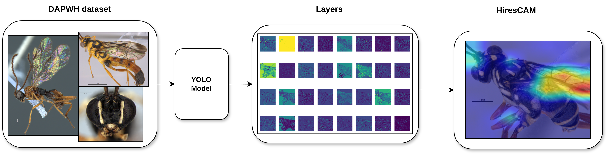

<h1 align="center">
  Automated identification of Ichneumonoidea wasps
</h1>

<h3 align="center">
  Automated identification of Ichneumonoidea wasps via YOLO-based deep learning: Integrating HiresCam for Explainable AI
</h3>

<p align="center">
  <strong>João Manoel Herrera Pinheiro</strong><sup>1</sup> &middot;
  <strong>Gabriela do Nascimento Herrera</strong><sup>2</sup> &middot;
  <strong>Alvaro Doria dos Santos</strong><sup>3</sup> &middot;
  <strong>Luciana Bueno dos Reis Fernandes</strong><sup>2</sup> &middot;
  <strong>Ricardo V. Godoy</strong><sup>1</sup><br>
  <strong>Eduardo A. B. Almeida</strong><sup>4</sup> &middot;
  <strong>Helena Carolina Onody</strong><sup>5</sup> &middot;
  <strong>Marcelo Andrade da Costa Vieira</strong><sup>1</sup> &middot;
  <strong>Angelica Maria Penteado-Dias</strong><sup>2</sup> &middot;
  <strong>Marcelo Becker</strong><sup>1</sup>
</p>

<p align="center">
  <sup>1</sup> São Carlos School of Engineering, University of São Paulo (USP), São Carlos, Brazil<br>
  <sup>2</sup> Department of Ecology and Evolutionary Biology, Federal University of São Carlos (UFSCar), São Carlos, Brazil<br>
  <sup>3</sup> Federal University of Tocantins (UFT), Porto Nacional, Brazil<br>
  <sup>4</sup> Department of Biology (FFCLRP), University of São Paulo (USP), Ribeirão Preto, Brazil<br>
  <sup>5</sup> Deputado Jesualdo Cavalcanti Campus, State University of Piauí (UESPI), Corrente, Brazil
</p>

<p align="center">
  <em> preprint, 2026</em>
</p>

<p align="center">
  <a href="https://arxiv.org/abs/2403.09548">
    
  </a>&nbsp;
  <a href="https://arxiv.org/abs/2403.09548">
    
  </a>&nbsp;
  <a href="https://doi.org/10.1109/IEEEDATA.2026.3683381">
    
  </a>
</p>

This repository contains the data processing pipelines and training workflows developed for the Automated identification of Ichneumonoidea wasps via YOLO-based deep learning: Integrating HiresCam for Explainable AI.


## Dataset
The DAPWH dataset is publicly available on Zenodo:

- [https://zenodo.org/records/18501018](https://zenodo.org/records/18501018)
- DOI: [https://doi.org/10.5281/zenodo.18501017](https://doi.org/10.5281/zenodo.18501017)

### Download the file using curl

```bash
curl -L "https://zenodo.org/records/18501018/files/DAPWH.zip?download=1" -o DAPWH.zip
```

### Create raw data directory and extract
```bash
mkdir -p data/raw
unzip DAPWH.zip -d data/raw/
```

## Script 1: Data Partitioning and Rescaling (`datasplit.py`)

This script implements your methodology: splitting the data into a **60/20/20** ratio and resizing high-resolution captures to $512 \times 512$.

```python
import os
import shutil
import splitfolders
import pandas as pd
from pathlib import Path

# --- CONFIGURATION ---
# Based on Zenodo record 18501018 structure
BASE_DIR = Path('data/raw/DAPWH') 
# Update VIEWS to match your specific folder names exactly
VIEWS = ['Dorsal_Ventral', 'Frontal', 'Lateral'] 
MERGED_DIR = Path('data/processed/DAPWH_Merged_by_Family')
SPLIT_DIR = Path('data/processed/DAPWH_Final_Split')

def merge_and_split():
    # 1. Merge all views into a single family-based structure
    if MERGED_DIR.exists():
        shutil.rmtree(MERGED_DIR) # Clean start to avoid duplicate counting
    MERGED_DIR.mkdir(parents=True)
        
    for view in VIEWS:
        # FIX: BASE_DIR already points to the root of the extracted files
        view_path = BASE_DIR / view 
        if not view_path.exists():
            print(f"Warning: View path {view_path} not found. Skipping.")
            continue
        
        for family_folder in view_path.iterdir():
            if family_folder.is_dir():
                # Ignore metadata/COCO folders to focus on taxonomic complexity
                if "COCO" in family_folder.name: continue 
                
                target_family_dir = MERGED_DIR / family_folder.name
                target_family_dir.mkdir(exist_ok=True)
                
                for img in family_folder.glob('*'):
                    if img.is_file() and img.suffix.lower() in ['.jpg', '.png', '.jpeg', '.tif']:
                        # Prefix prevents collisions between different views
                        new_name = f"{view}_{img.name}"
                        shutil.copy2(img, target_family_dir / new_name)

    print(f"Merge complete: {MERGED_DIR}")

    # 2. Split into Train (70%), Val (15%), Test (15%)
    splitfolders.ratio(
        str(MERGED_DIR), 
        output=str(SPLIT_DIR), 
        seed=42, 
        ratio=(.7, .15, .15), 
        move=False
    )
    print(f"Split complete: {SPLIT_DIR}")

def count_dataset_distribution(root_dir):
    data = []
    phases = ['train', 'val', 'test']
    
    # Identify families from the processed train folder
    families = sorted([d.name for d in (root_dir / 'train').iterdir() if d.is_dir()])
    
    for family in families:
        row = {'Family': family}
        total_family = 0
        for phase in phases:
            phase_family_path = root_dir / phase / family
            count = len(list(phase_family_path.glob('*'))) if phase_family_path.exists() else 0
            row[phase] = count
            total_family += count
        
        row['Total'] = total_family
        data.append(row)
    
    df = pd.DataFrame(data)
    # Summarize totals for the final row
    totals = df.select_dtypes(include=['number']).sum()
    df_total = pd.DataFrame([{'Family': 'TOTAL SYSTEM', **totals}])
    return pd.concat([df, df_total], ignore_index=True)

if __name__ == "__main__":
    merge_and_split()
    
    # 3. Generate Report
    print("\n Dataset Distribution by family\:")
    distribution_df = count_dataset_distribution(SPLIT_DIR)
    print(distribution_df.to_string(index=False))
```

## Script 2: Traning YOLO models (`yolo_train.py`)

This script is responsible for training the YOLOv12 and YOLOv26 architectures. Before execution, ensure that the pre-trained weights (.pt files) are located in the project's root directory.

```python
import os
import gc
import torch
import shutil
import numpy as np
import pandas as pd
from ultralytics import YOLO
from pathlib import Path

# --- CONFIGURATION ---
# Path to your already divided dataset (classification format)
DATA_ROOT = Path('data/processed/DAPWH_Final_Split')
# Testing the SOTA extra-large variants
MODELS_TO_TRAIN = ['yolov12n-cls', 'yolo26n-cls'] 
RESULTS_DIR = Path('reports/model_comparison')
RESULTS_DIR.mkdir(parents=True, exist_ok=True)

def clear_gpu_memory():
    """Clears VRAM to prevent fragmentation."""
    if torch.cuda.is_available():
        torch.cuda.empty_cache()
        torch.cuda.ipc_collect()
    gc.collect()
    print("🧹 GPU memory cache cleared.")

def train_and_evaluate():
    summary_data = []

    for model_name in MODELS_TO_TRAIN:
        print(f"\n🚀 Starting Training: {model_name}")
        
        # 1. Load Model
        model = YOLO(f"{model_name}.pt")
        
        # 2. Train Model
        train_results = model.train(
            data=DATA_ROOT,
            epochs=150,
            imgsz=512,
            batch=32,
            name=f"DAPWH_{model_name}",
            exist_ok=True
        )

        # 3. Final Evaluation on Test Set
        print(f"📊 Evaluating {model_name} on Final Test Set...")
        metrics = model.val(split='test', plots=True) 

        # --- FIX: Manual Metric Extraction for Classification ---
        # Accessing the internal confusion matrix for Precision/Recall calculation
        cm = metrics.confusion_matrix.matrix
        
        # Rows = True, Cols = Predicted
        tp = cm.diagonal()
        fp = cm.sum(axis=0) - tp
        fn = cm.sum(axis=1) - tp
        
        eps = 1e-7 # Prevent division by zero
        precision_per_class = tp / (tp + fp + eps)
        recall_per_class = tp / (tp + fn + eps)
        
        mean_precision = precision_per_class.mean()
        mean_recall = recall_per_class.mean()
        f1_score = 2 * (mean_precision * mean_recall) / (mean_precision + mean_recall + eps)

        # 4. Export Confusion Matrix Image
        cm_src = Path(train_results.save_dir) / 'confusion_matrix.png'
        cm_dest = RESULTS_DIR / f"CM_{model_name}_test.png"
        if cm_src.exists():
            shutil.copy(cm_src, cm_dest)
            print(f" Confusion Matrix saved to: {cm_dest}")

        # 5. Append Results
        summary_data.append({
            'Model': model_name,
            'Accuracy (Top1)': round(metrics.top1, 4),
            'Precision': round(mean_precision, 4),
            'Recall': round(mean_recall, 4),
            'F1-Score': round(f1_score, 4),
            'Fitness': round(metrics.fitness, 4)
        })
        
        # Cleanup for next iteration
        del model
        clear_gpu_memory()

    # 6. Save Comparison Report
    df = pd.DataFrame(summary_data)
    df.to_csv(RESULTS_DIR / 'model_performance_summary.csv', index=False)
    
    print("\n Final Comparison Table (Test Set Results):")
    print(df.to_string(index=False))

if __name__ == "__main__":
    train_and_evaluate()
```
### Script 3: YOLO layers (`yolo_layers.py`)
This script utilizes the Ultralytics framework to visualize the internal feature maps and convolutional layers of the YOLO models. It is designed to generate graphical representations of the neural network's architecture and the activation maps triggered during the identification process.

```python
import cv2
import numpy as np
import torch
from pathlib import Path
from ultralytics import YOLO
from PIL import Image

# --- CONFIGURATION ---
MODEL_PATH = 'runs/classify/DAPWH_yolo26n-cls/weights/best.pt'
TEST_DIR = Path('data/processed/DAPWH_Final_Split/test')
OUTPUT_BASE = Path('reports/YOLO_CAM')


# 1. Load the SOTA Model
model = YOLO(MODEL_PATH)

def run_full_cam():
    # Support for all requested formats (including high-res TIF/PNG)
    extensions = {'.jpg', '.jpeg', '.png', '.tif', '.tiff', '.bmp'}
    
    # Gather all images from the test set
    image_files = [p for p in TEST_DIR.rglob('*') if p.suffix.lower() in extensions]
    total_imgs = len(image_files)
    
    print(f"Starting full analysis of {total_imgs} images on RTX 4090...")

    for idx, img_path in enumerate(image_files):
        try:
            # Use PIL for TIF compatibility, then convert for OpenCV/YOLO
            img_pil = Image.open(img_path).convert('RGB')
            img_np = np.array(img_pil)
            img_bgr = cv2.cvtColor(img_np, cv2.COLOR_RGB2BGR)

            # Generate visualization
            # name defines the subfolder for this specific image's feature maps
            results = model.predict(
                source=img_bgr,
                imgsz=512,
                visualize=True, 
                name=f"CAM_{img_path.stem}",
                project=OUTPUT_BASE,
                exist_ok=True
            )

            if idx % 50 == 0:
                print(f"Processed {idx}/{total_imgs} images...")
                torch.cuda.empty_cache() # Prevent VRAM fragmentation

        except Exception as e:
            print(f"Error processing {img_path.name}: {e}")

if __name__ == "__main__":
    run_full_cam()
    print(f" Full analysis complete. Results saved in: {OUTPUT_BASE}")
```

## Script 4: HiresCAM (`yolo_hirescam.py`)
This script performs Explainable AI (XAI) analysis using the HiResCAM algorithm on the trained YOLO models. It generates high-resolution heatmaps that visualize the specific morphological features prioritized by the neural network during taxonomic classification.

```python
import torch.nn as nn
from pytorch_grad_cam import GradCAM, HiResCAM
from pytorch_grad_cam.utils.image import show_cam_on_image, preprocess_image
from tqdm import tqdm
# --- CONFIGURATION ---
OUTPUT_DIR = Path('reports/HiResCAM_Visualizations')
SOURCE_DIR = TEST_DIR
USE_HIRESCAM = True

# --- WRAPPER CLASS ---
class YOLOCAMWrapper(nn.Module):
    def __init__(self, yolo_model):
        super(YOLOCAMWrapper, self).__init__()
        self.model = yolo_model

    def forward(self, x):
        result = self.model(x)
        if isinstance(result, tuple):
            return result[0]
        return result

def run_annotated_gradcam():
    print(f"Loading Model: {MODEL_PATH}")
    # Load YOLO
    hub_model = YOLO(MODEL_PATH)
    
    # Get class names from the model (e.g., {0: 'Braconidae', 1: 'Colletidae', ...})
    class_names = hub_model.names
    print(f"Model Classes: {class_names}")

    # Force Gradients ON
    for param in hub_model.model.parameters():
        param.requires_grad = True
        
    # Setup Wrapper
    model = YOLOCAMWrapper(hub_model.model)
    model.eval()
    
    # Target Layer
    target_layers = [model.model.model[-2]]
    
    # Setup CAM
    cam_cls = HiResCAM if USE_HIRESCAM else GradCAM
    cam = cam_cls(model=model, target_layers=target_layers)

    # Find Images
    extensions = ['*.jpg', '*.jpeg', '*.png', '*.JPG', '*.PNG', '*.tif', '*.tiff','*.TIF','*.TIFF']
    all_images = []
    for ext in extensions:
        all_images.extend(list(Path(SOURCE_DIR).rglob(ext)))
    
    print(f"Found {len(all_images)} images to process.")

    # --- PROCESSING LOOP ---
    for img_path in tqdm(all_images, desc="Analyzing"):
        try:
            # 1. Get Ground Truth from Folder Name
            # e.g., .../val/Braconidae/img1.jpg -> true_label = "Braconidae"
            true_label = img_path.parent.name
            
            # 2. Load & Preprocess
            img_pil = Image.open(img_path).convert('RGB')
            original_w, original_h = img_pil.size
            
            img_resized = np.array(img_pil.resize((224, 224)))
            rgb_img_float = np.float32(img_resized) / 255.0
            
            input_tensor = preprocess_image(rgb_img_float, mean=[0,0,0], std=[1,1,1])
            input_tensor.requires_grad = True

            # 3. Run Inference (Get Prediction)
            # We run a forward pass to get logits
            logits = model(input_tensor)
            pred_idx = torch.argmax(logits, dim=1).item()
            pred_label = class_names[pred_idx]
            
            # Check correctness
            is_correct = (pred_label == true_label)
            
            # 4. Generate Heatmap
            grayscale_cam = cam(input_tensor=input_tensor, targets=None)
            grayscale_cam = grayscale_cam[0, :]
            
            # Upscale
            heatmap_high_res = cv2.resize(grayscale_cam, (original_w, original_h))
            rgb_img_high_res = np.float32(img_pil) / 255.0
            visualization = show_cam_on_image(rgb_img_high_res, heatmap_high_res, use_rgb=True)
            
            # Convert to BGR for OpenCV drawing
            visualization_bgr = cv2.cvtColor(visualization, cv2.COLOR_RGB2BGR)

            # 5. Add Text Annotation
            # Green if correct, Red if wrong
            color = (0, 255, 0) if is_correct else (0, 0, 255) 
            status_text = "CORRECT" if is_correct else "WRONG"
            
            text = f"True: {true_label} | Pred: {pred_label} ({status_text})"
            
            # Draw black background rectangle for text readability
            #cv2.rectangle(visualization_bgr, (0, 0), (original_w, 150), (0, 0, 0), -1)

            # 6. Save File
            # Prefix filename with status for easy sorting
            prefix = "CORRECT_" if is_correct else "WRONG_"
            new_filename = prefix + img_path.name
            
            # Save structure: output/Braconidae/WRONG_img1.jpg
            relative_folder = img_path.parent.name
            save_folder = Path(OUTPUT_DIR) / relative_folder
            save_folder.mkdir(parents=True, exist_ok=True)
            
            save_path = save_folder / new_filename
            cv2.imwrite(str(save_path), visualization_bgr)

        except Exception as e:
            print(f"\nSkipped {img_path.name}: {e}")
            continue

    print(f"\nDone! Check folder: {OUTPUT_DIR}")

if __name__ == '__main__':
    run_annotated_gradcam()
```
